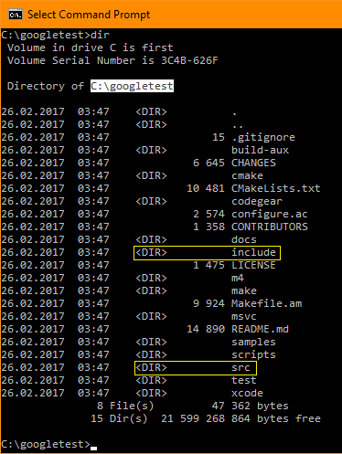
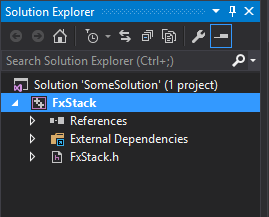

### Введение

Фреймворк тестирования от Google (GTest) основан на архитектуре xUnit. Такие архитектуры имеют следующие базовые компоненты:

- модуль, выполняющий тестирование (Test runner);
- тестовые сценарии (Test cases);
- конфигурации тестирования (Test fixtures);
- наборы тестов (Test suites);
- выполнение тестов (Test execution);
- форматирование результатов тестирования (Test result formatter);
- утверждения (Assertions).

GTest является кросплатформенной системой, поддерживающей автоматическое обнаружение тестов. Это значит, что пользователю не нужно вручную перечислять все тесты в тестовом наборе. GTest поддерживает множество утверждений, таких как фатальные утверждения (с префиксом `ASSERT_`), нефатальные утверждения (с префиксом `EXPECT_`), и тесты "смерти", проверяющие, что программа завершит свою работу ожидаемым образом.

Об элементарных принципах GTest можно почитать [здесь](https://github.com/google/googletest).

GTest поддерживает различные опции запуска тестов и предоставляет возможность сохранения результатов тестов в текстовом виде и в виде XML-отчёта.

Также GTest поддерживает тестирование с использованием mock-объектов, т.е. объектов, преставляющих собой фиктивную реализацию некоторого интерфейса (заглушку) - Google Mock.

Чтобы начать использование GTest необходимо выполнить следующие пункты:

- Скачать Google test.
- Скомпилировать Google test в статическую библиотеку.
- Создать проект unit-теста.
- Создать тестовые сценарии.

### 0. После введения

Для начала, предположим, что у нас есть реализация шаблонного класса стека с фиксированным размером -- класс `FxStack`. Объявление класса `FxStack` следующее:

```cpp
template<typename Type, int size_>
class FxStack {
public:
    bool empty() const;
    bool full() const;
    Type pop();
    void push(Type val);
    int size() const;
    int sp() const;
    const Type& top() const;
    Type& top();

private:
    Type data_[size_];
    int sp_ = -1;
};
```

В дальнейшем именно методы класса `FxStack` будут тестироваться с помощью GTest.

### 1. Получение GTest

Прежде чем начать работу с GTest его необходимо [загрузить](https://github.com/google/googletest). Можно клонировать репозиторий или загрузить его в виде zip-архива:


Исходный код фреймворка GTest расположен в подпапке `googletest/`. Разархивируем папку `googletest/`, например, в корень диска C. В дальнейшей работе нам необходимо будет содержимое подпапок `include/` и `src/`:



В подпапке `src/` находятся файлы исходного кода фреймворка GTest, а в `include/` -- заголовочные файлы.

### 2. Компиляция GTest в статическую библиотеку

На данный момент у нас есть "решение" SomeSolution с проектом реализующим шаблонный класс `FxStack`, методы которого необходимо будет тестировать:



Добавим к SomeSolution новый проект, компилируемый в статическую библиотеку, который будет служить для создания статической библиотеки GTest. Выполним следующую последовательность действий через меню VS:

- File -> Add -> New Project.
- Выбераем шаблон Win32 -> Win32 Console Application.
- Задаём имя проекта, например, gtestlib. Жмём "OK".
- В открывшемся модальном диалоговом окне жмём Next и выбираем тип приложения "Static library", снимаем галочку "Precompiled header". Жмём "Finish".


Получаем следующую структуру "решения":


Заходим в свойства проекта gtestlib через его контекстное меню, нажав RMB на имени проекта и выбрав "Properties". В настройках переходим на закладку "VC++ Directories" и задаём новые значения в поле "Include Dictionaries": путь к корневой папке фреймвока GTest (C:\googletest) и к его подпапке `include/` (C:\googletest\include).


Также, через контекстное меню проекта gtestlib, Project -> Add Existing Item, добавляем в него файлы исходного кода фреймворка GTest: gtest_all.cc и gtest_main.cc, находящиеся в вышеупомянутой подпапке `src/` (C:\googletest\src).


Делаем сборку проекта gtestlib в статическую библиотеку (команда Build):


### 3. Создание проекта unit-теста

Добавим к решению SomeSolution проект Win32 Console Application, например, с именем unittest_FxStack, используя меню, File -> Add -> New project. При создании проекта в дополнительных опциях настроек проекта установим галочку "Empty project".


Теперь необходимо в настройках проекта добавить пути к корневой директории фреймворка GTest, к её подпапке include, а также к папке с исходными/заголовочными файлами тестируемого проекта:


К проекту unittest_FxStack добавим ссылки на проекты gtestlib и FxStack. -- Через контекстное меню проекта unittest_FxStack переходим по Add -> Reference..., и выбираем необходимые проекты:


В итоге в проекте unittest_FxStack отобразятся добавленные зависимости:


### 4. Создание тестовых сценариев

В проект unittest_FxStack необходимо добавить файл исходных кодов (cpp-файл) в котором будут размещены тестовые сценарии, например, файл FxStackTestCases.cpp:


Первое, что нужно сделать в созданном файле -- подключить заголовочный файл тестируемой сущности, в данном случае заголовочный файл шаблоного класса стека с фиксированным размером. Второе, -- подключить заголовочный файл фреймворка GTest:

```cpp
#include <FxStack.h>

#include <gtest/gtest.h>
```

Далее очередь за написанием тестовых сценариев. Синтаксис сценариев следующий:

```cpp
TEST(имя_тестового_сценария, имя_теста)
{
	/* тело_сценария */
}
```

Имя тестового сценария и имя теста могут быть произвольными.

Чтобы протестировать метод `size()` класса `FxStack`, можно создать следующий сценарий:

```cpp
TEST(FxStack, Size)
{
    FxStack<int, 3> stack;

    EXPECT_EQ(stack.size(), 3);
}
```

Для тестирования методов `push()` и `pop()`, можно создать сценарии следующего содержания:

```cpp
TEST(FxStack, Push)
{
    FxStack<int, 3> stack;

    EXPECT_NO_FATAL_FAILURE(stack.push(11));
    EXPECT_NO_FATAL_FAILURE(stack.push(22));
    EXPECT_NO_FATAL_FAILURE(stack.push(33));
    EXPECT_THROW(stack.push(44), std::overflow_error);
}

TEST(FxStack, Pop)
{
    FxStack<int, 3> stack;
    stack.push(11);
    stack.push(22);
    stack.push(33);

    EXPECT_EQ(stack.pop(), 33);
    EXPECT_EQ(stack.pop(), 22);
    EXPECT_EQ(stack.pop(), 11);
    EXPECT_THROW(stack.pop(), std::underflow_error);
}
```

Для методов проверки пустоты и заполненности стека (соответственно, методы `empty()` и `full()`), можно применить такие тестовые сценарии:

```cpp
TEST(FxStack, Empty)
{
    FxStack<int, 3> stack;

    EXPECT_TRUE(stack.empty());
}

TEST(FxStack, Full)
{
    FxStack<int, 3> stack;
    stack.push(11);
    stack.push(22);
    stack.push(33);

    EXPECT_TRUE(stack.full());
}
```

Проверку корректности метода `top()` -- метода доступа к последнему элементу без удаления из стека, можно сделать следующим образом:

```cpp
TEST(FxStack, Top)
{
    FxStack<int, 3> stack;

    stack.push(11);
    EXPECT_EQ(stack.top(), 11);

    stack.push(22);
    EXPECT_EQ(stack.top(), 22);

    EXPECT_NO_FATAL_FAILURE(stack.top() = 33);
    EXPECT_EQ(stack.top(), 33);
}
```

И, наконец, метод получения индекса вершины стека - `sp()`, используемого для проверки величины заполненности стека, можно протестировать так:

```cpp
TEST(FxStack, StackPointer)
{
    FxStack<int, 3> stack;

    EXPECT_EQ(stack.sp(), -1);

    stack.push(11);
    EXPECT_EQ(stack.sp(), 0);

    stack.push(22);
    EXPECT_EQ(stack.sp(), 1);
}
```

Напомним, что все тестовые сценарии располагаются в файле FxStackTestCases.cpp. Теперь необходимо собрать (Build) проект unittest_FxStack и запустить созданный exe-файл. Результат его выполнения, в данном случае, получится следующим:


Видно, какой тест был запушен, какой тест был успешно выполнен и общий статус успешности прохождения тестового сценария.

По мотивам [статьи](http://www.bogotobogo.com/cplusplus/google_unit_test_gtest.php).